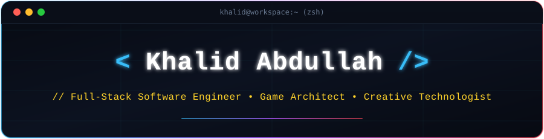
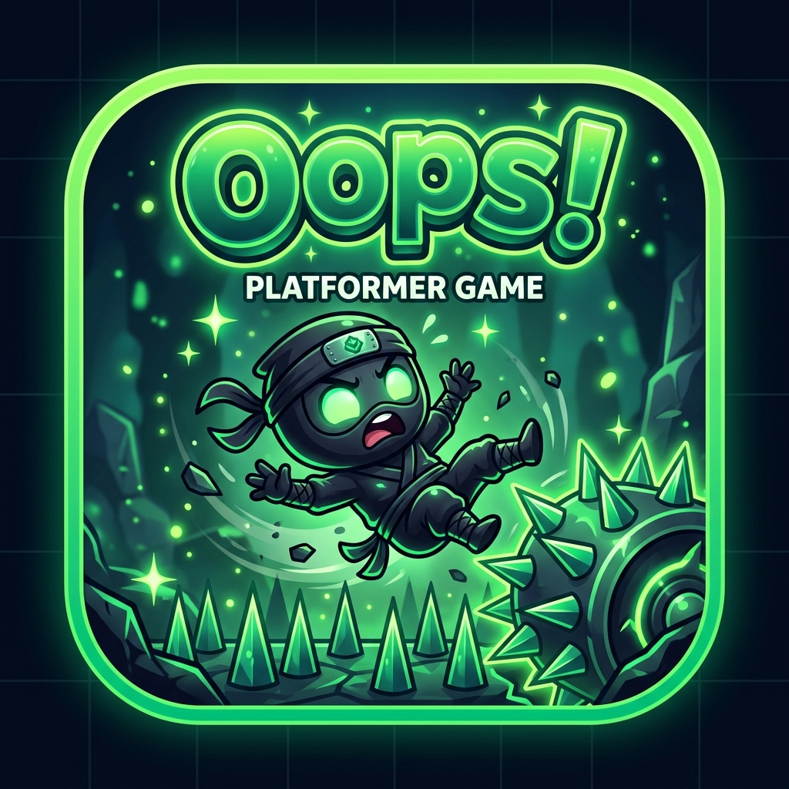
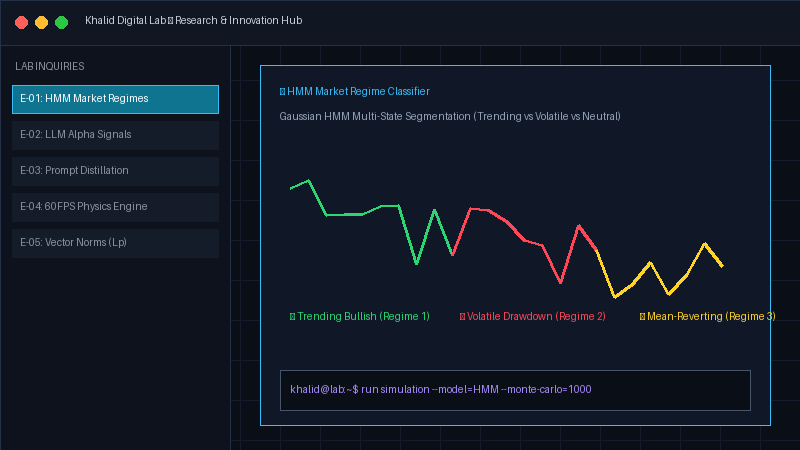
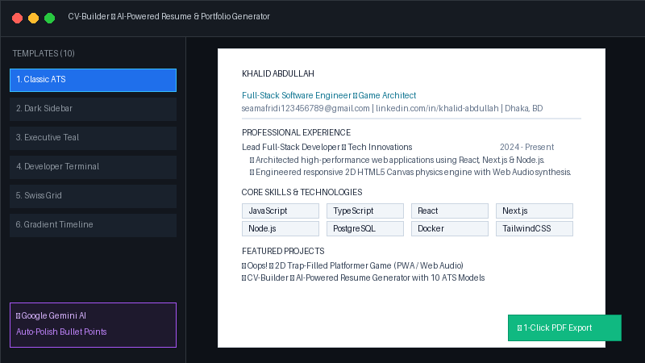

<div align="center">

<!-- Dark Minimal Coder Header SVG -->


<br/>

<!-- Terminal Coder Typing Animation -->
<a href="https://github.com/khalidabdullahh">
  
</a>

<p align="center">
  <code>⚡ "Keep your code clean, your architecture resilient, and your curiosity boundless." ⚡</code>
</p>

</div>

---

### 📌 About Me

```javascript
const khalid = {
  name: "Khalid Abdullah",
  role: "Full-Stack Software Engineer & Game Developer",
  location: "Bangladesh",
  passions: [
    "Full-Stack Web Architecture",
    "Game Physics & Canvas Engines",
    "Quantitative Tools & AI Workflows",
    "Creative UI/UX & Responsive Design"
  ],
  currentFocus: "Building production-grade web applications, quantitative tools, and interactive games"
};
```

👋 Welcome! I'm **Khalid**, a passionate **Full-Stack Software Engineer & Game Developer** dedicated to building intuitive web applications, robust quantitative tools, and responsive canvas game engines. I love turning ambitious ideas into polished, high-performance software experiences.

---

### 🧠 Core Focus Areas

- 🚀 **Full-Stack Web Engineering:** Scalable microservices, RESTful APIs, and reactive SPAs built with modern TypeScript, React, Next.js, and Node.js.
- 🎮 **Game Physics & Canvas Engines:** Zero-dependency procedural 2D canvas engines, real-time audio synthesis (Web Audio API), and PWA architectures.
- 🧪 **AI & Quantitative Tools:** Intelligent resume generators, financial market regime classifiers (HMM), and interactive analytics simulators.
- ⚡ **Database & Cloud Systems:** Efficient database queries (PostgreSQL, MongoDB), Docker containerization, and seamless CI/CD delivery pipelines.

---

### 🛠️ Languages & Tools

<div align="center">

| Category | Technologies & Tools |
|---|---|
| **Programming Languages** |  |
| **Frontend Ecosystem** |  |
| **Backend & Databases** |  |
| **DevOps & Cloud** |  |
| **Workflow & Tooling** |  |

</div>

---

### 🌟 Featured Projects

<table>
  <tr>
    <td width="50%" valign="top">
      <h3 align="center">🎮 Oops! — 2D Ninja Platformer</h3>
      <p align="center">
        <a href="https://khalidabdullahh.github.io/Oops/"></a>
      </p>
      <p>A deceptive, trap-filled 2D HTML5 platformer inspired by Level Devil with procedural Web Audio sound synthesis, mobile touch gamepad, and offline PWA capability.</p>
      <p align="center">
        <a href="https://khalidabdullahh.github.io/Oops/"><b>🕹️ Play Live in Browser</b></a> &nbsp;|&nbsp;
        <a href="https://github.com/khalidabdullahh/Oops"><b>📂 Source Code</b></a>
      </p>
    </td>
    <td width="50%" valign="top">
      <h3 align="center">🧪 Khalid Digital Lab</h3>
      <p align="center">
        <a href="https://khalid-digital-lab.vercel.app"></a>
      </p>
      <p>Interactive personal digital laboratory & innovation hub featuring HMM market regime classifiers, interactive ATS matching, and developer CLI tools.</p>
      <p align="center">
        <a href="https://khalid-digital-lab.vercel.app"><b>🚀 Live Web App</b></a> &nbsp;|&nbsp;
        <a href="https://github.com/khalidabdullahh/khalid-digital-lab"><b>📂 Source Code</b></a>
      </p>
    </td>
  </tr>
  <tr>
    <td width="50%" valign="top">
      <h3 align="center">📄 CV-Builder — AI Resume Generator</h3>
      <p align="center">
        <a href="https://first-project-plum-phi.vercel.app"></a>
      </p>
      <p>An intelligent, ATS-friendly resume creator featuring 10 customizable professional models, Google Gemini AI writing assistant, and 1-click HD PDF export.</p>
      <p align="center">
        <a href="https://first-project-plum-phi.vercel.app"><b>🚀 Live Web App</b></a> &nbsp;|&nbsp;
        <a href="https://github.com/khalidabdullahh/CV-Builder"><b>📂 Source Code</b></a>
      </p>
    </td>
    <td width="50%" valign="top">
      <h3 align="center">📊 Trading-OS</h3>
      <p align="center">
        <a href="https://trading-os-blue.vercel.app"></a>
      </p>
      <p>A modern financial market analytics and trading operating system architecture designed for real-time charting, telemetry, and portfolio tracking.</p>
      <p align="center">
        <a href="https://trading-os-blue.vercel.app"><b>🚀 Live Web App</b></a> &nbsp;|&nbsp;
        <a href="https://github.com/khalidabdullahh/Trading-OS"><b>📂 Source Code</b></a>
      </p>
    </td>
  </tr>
</table>

---

### 📊 GitHub Activity & Statistics

<div align="center">

<table border="0">
  <tr>
    <td align="center" width="50%">
      
    </td>
    <td align="center" width="50%">
      
    </td>
  </tr>
</table>

</div>

---

### 🤝 Connect with Me

<div align="center">

<p>Feel free to reach out for collaborations, project inquiries, or just to say hello!</p>

<table border="0">
  <tr>
    <td align="center">
      <a href="mailto:seamafridi123456789@gmail.com">
        
      </a>
    </td>
    <td align="center">
      <a href="https://www.linkedin.com/in/khalid-abdullah-847724339" target="_blank">
        
      </a>
    </td>
  </tr>
  <tr>
    <td align="center">
      <a href="https://wa.me/8801643526721" target="_blank">
        
      </a>
    </td>
    <td align="center">
      <a href="https://www.facebook.com/khalidabdullah19" target="_blank">
        
      </a>
    </td>
  </tr>
  <tr>
    <td colspan="2" align="center">
      <a href="https://github.com/khalidabdullahh">
        
      </a>
    </td>
  </tr>
</table>

</div>

---

<div align="center">

<p align="center">
  
</p>

</div>
