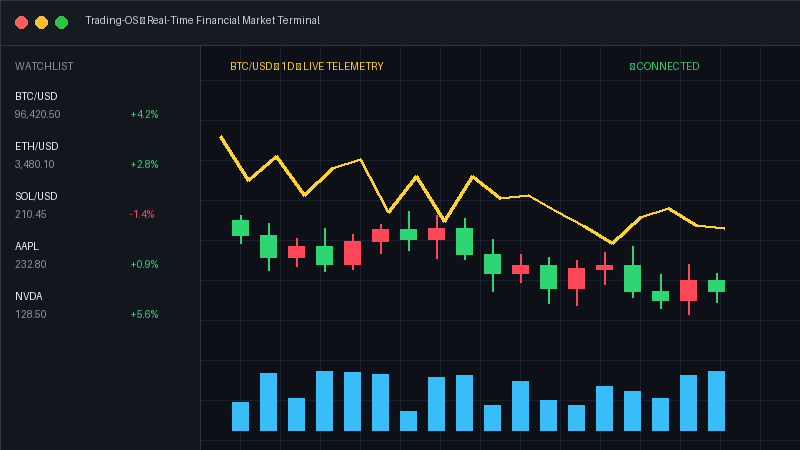

<div align="center">

<!-- Header Banner -->


<!-- Typing SVG Animation -->
<a href="https://github.com/khalidabdullahh">
  
</a>

<br/>

<!-- Top Badges Row -->
<p align="center">
  <a href="mailto:seamafridi123456789@gmail.com"></a>
  <a href="https://www.linkedin.com/in/khalid-abdullah-847724339" target="_blank"></a>
  <a href="https://wa.me/8801643526721" target="_blank"></a>
  <a href="https://www.facebook.com/khalidabdullah19" target="_blank"></a>
  
</p>

</div>

---

### 📌 About Me

```javascript
const khalid = {
  name: "Khalid Abdullah",
  role: "Full-Stack Software Engineer & Game Developer",
  location: "Bangladesh",
  passions: ["Full-Stack Architecture", "Game Physics & Engines", "Creative UI/UX", "High-Performance Systems"],
  currentFocus: "Building production-grade web applications and high-fidelity interactive games",
  mindset: "Keep your code clean, your architectures resilient, and your curiosity boundless."
};
```

👋 Hey there! I'm **Khalid**, a passionate **Full-Stack Developer & Game Architect** dedicated to crafting intuitive digital products, resilient distributed backends, and responsive canvas game engines. I specialize in turning complex challenges into streamlined, high-performance user experiences.

---

### 🧠 My Core Focus Areas

- 🚀 **Full-Stack Engineering:** Scalable microservices, RESTful APIs, and reactive SPAs built with modern TypeScript, React, Next.js, and Node.js.
- 🎮 **Game Physics & Interactive Graphics:** Zero-dependency procedural 2D/3D canvas engines, real-time audio synthesis (Web Audio API), and PWA architecture.
- ⚡ **Database & Cloud Optimization:** Efficient query designs, state management, Docker containerization, and seamless CI/CD delivery.

---

### 🛠️ Tech Stack & Tooling

<div align="center">

| Category | Technologies & Tools |
|---|---|
| **Programming Languages** |  |
| **Frontend Ecosystem** |  |
| **Backend & Databases** |  |
| **DevOps & Cloud** |  |
| **Workflow & Tooling** |  |

</div>

---

### 🌟 Featured Projects

<table>
  <tr>
    <td width="50%" valign="top">
      <h3 align="center">🎮 Oops! — 2D Platformer</h3>
      <p align="center">
        <a href="https://khalidabdullahh.github.io/Oops/"></a>
      </p>
      <p>A deceptive, trap-filled 2D HTML5 platformer inspired by Level Devil with procedural Web Audio sound synthesis, mobile touch gamepad, and offline PWA capability.</p>
      <p align="center">
        <a href="https://khalidabdullahh.github.io/Oops/"><b>🕹️ Play Live in Browser</b></a> &nbsp;|&nbsp;
        <a href="https://github.com/khalidabdullahh/Oops"><b>📂 Source Code</b></a>
      </p>
    </td>
    <td width="50%" valign="top">
      <h3 align="center">📊 Trading-OS</h3>
      <p align="center">
        <a href="https://github.com/khalidabdullahh/Trading-OS"></a>
      </p>
      <p>A modern financial market analytics and trading operating system architecture designed for real-time charting, telemetry, and portfolio tracking.</p>
      <p align="center">
        <a href="https://github.com/khalidabdullahh/Trading-OS"><b>📂 View Repository</b></a>
      </p>
    </td>
  </tr>
</table>

---

### 📊 GitHub Activity & Statistics

<div align="center">

<table border="0">
  <tr>
    <td align="center" width="50%">
      
    </td>
    <td align="center" width="50%">
      
    </td>
  </tr>
</table>

</div>

---

### 🤝 Connect with Me

<p align="center">
  <a href="mailto:seamafridi123456789@gmail.com"></a>
  <a href="https://www.linkedin.com/in/khalid-abdullah-847724339" target="_blank"></a>
  <a href="https://wa.me/8801643526721" target="_blank"></a>
  <a href="https://www.facebook.com/khalidabdullah19" target="_blank"></a>
  <a href="https://github.com/khalidabdullahh"></a>
</p>

---

<div align="center">


<p>⚡ <i>"Stay curious, keep building, and never stop leveling up."</i> ⚡</p>

</div>
