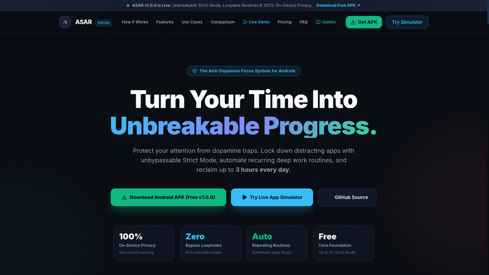
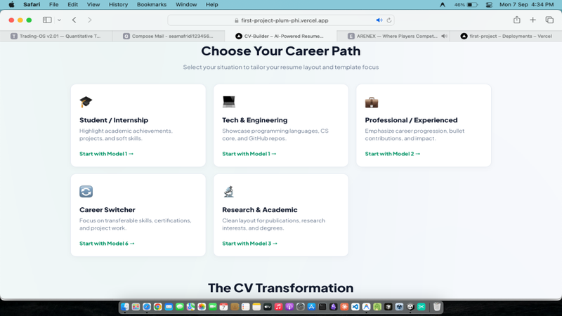
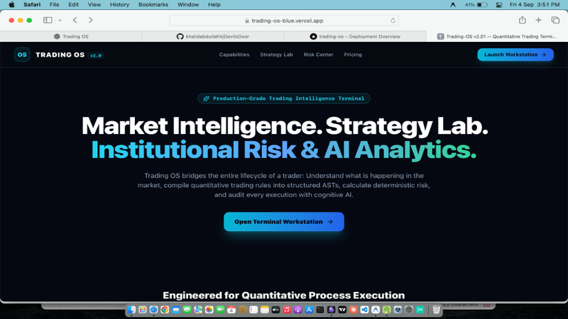
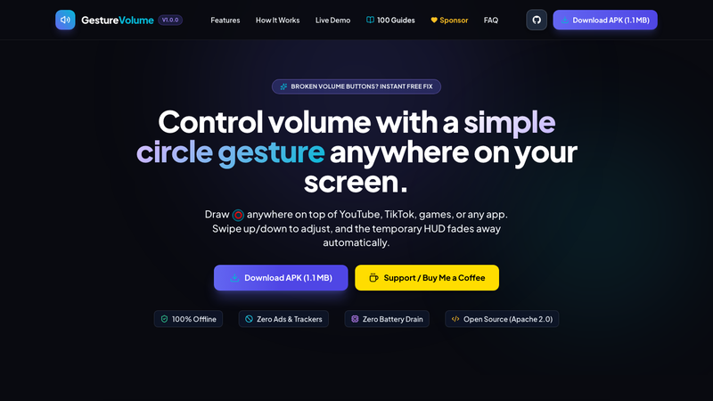
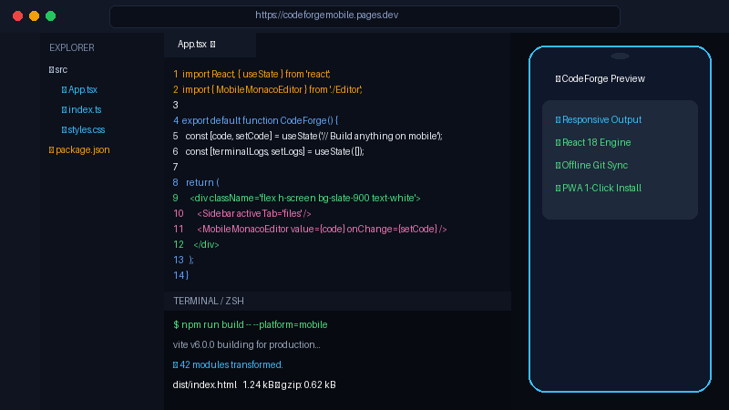
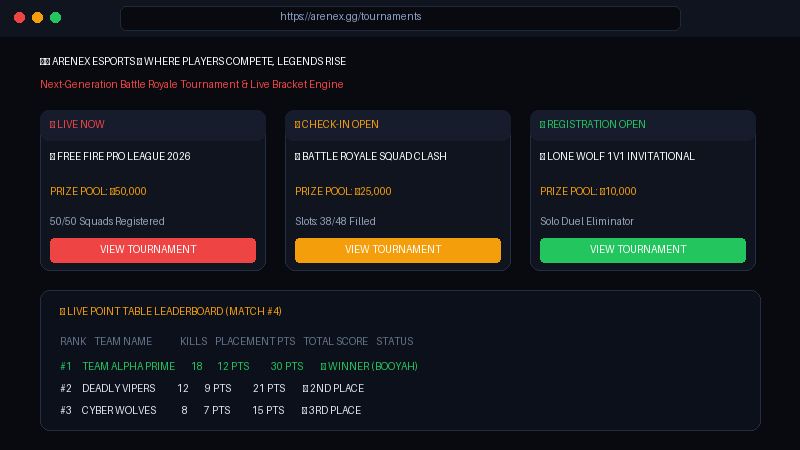

<div align="center">

<!-- Dark Minimal Coder Header SVG -->


<br/>

<!-- Terminal Coder Typing Animation -->
<a href="https://github.com/khalidabdullahh">
  
</a>

<p align="center">
  <code>⚡ "Keep your code clean, your architecture resilient, and your curiosity boundless." ⚡</code>
</p>

</div>

---

### 📌 About Me

```javascript
const khalid = {
  name: "Khalid Abdullah",
  role: "Full-Stack Software Engineer & Mobile Systems Developer",
  location: "Bangladesh",
  passions: [
    "Full-Stack Web Architecture & Cloud APIs",
    "Native Android Development (Kotlin & Jetpack Compose)",
    "Quantitative Financial Terminals & AI Workflows",
    "High-Performance Utilities & Esports Tournament Platforms"
  ],
  currentFocus: "Building production-grade web systems, native mobile utilities, and quantitative engineering tools"
};
```

👋 Welcome! I'm **Khalid**, a passionate **Full-Stack Software Engineer & Mobile Developer** dedicated to building intuitive web applications, robust quantitative tools, native Android utilities, and cloud-scale platforms. I love turning ambitious ideas into polished, high-performance software experiences.

---

### 🧠 Core Focus Areas

- 🚀 **Full-Stack Web Engineering:** Scalable microservices, RESTful APIs, and reactive SPAs built with modern TypeScript, React, Next.js, and Node.js.
- 📱 **Native Android & Mobile Systems:** Local-first architectures, Kotlin Jetpack Compose, Room SQLite, System Accessibility APIs, and Google Play Billing.
- 🧪 **AI & Quantitative Financial Tools:** Google Gemini AI natural language strategy compilers, multi-asset backtesting engines, and Monte Carlo risk simulators.
- ⚡ **Database & Cloud Systems:** Supabase PostgreSQL with RLS, Docker containerization, and seamless CI/CD automated deployment pipelines.

---

### 🛠️ Languages & Tools

<div align="center">

| Category | Technologies & Tools |
|---|---|
| **Programming Languages** |  |
| **Mobile & Frontend** |  |
| **Backend & Databases** |  |
| **DevOps & Cloud** |  |
| **Workflow & Tooling** |  |

</div>

---

### 🌟 Featured Projects

<table>
  <!-- ROW 1: ASAR (Android) & CV-Builder -->
  <tr>
    <td width="50%" valign="top">
      <h3 align="center">📱 ASAR — Focus & Digital Discipline</h3>
      <p align="center">
        <a href="https://github.com/khalidabdullahh/AegisFocus"></a>
      </p>
      <p>A native, local-first Android focus and digital discipline application engineered with Kotlin Jetpack Compose, Room SQLite, Supabase Cloud Sync, Google Play Billing, and Device Admin anti-uninstall protection.</p>
      <p align="center">
        <a href="https://github.com/khalidabdullahh/AegisFocus/releases"><b>📲 Download APK Release</b></a> &nbsp;|&nbsp;
        <a href="https://github.com/khalidabdullahh/AegisFocus"><b>📂 Source Code</b></a>
      </p>
    </td>
    <td width="50%" valign="top">
      <h3 align="center">📄 CV-Builder — AI Resume Generator</h3>
      <p align="center">
        <a href="https://first-project-plum-phi.vercel.app"></a>
      </p>
      <p>An intelligent, ATS-friendly resume creator featuring 10 customizable professional models, Google Gemini AI writing assistant, and 1-click HD PDF export without site clutter.</p>
      <p align="center">
        <a href="https://first-project-plum-phi.vercel.app"><b>🚀 Live Web App</b></a> &nbsp;|&nbsp;
        <a href="https://github.com/khalidabdullahh/CV-Builder"><b>📂 Source Code</b></a>
      </p>
    </td>
  </tr>

  <!-- ROW 2: Lumen OS (Trading-OS) & Gesture Volume -->
  <tr>
    <td width="50%" valign="top">
      <h3 align="center">📊 Lumen OS — Quant Trading Terminal</h3>
      <p align="center">
        <a href="https://trading-os-blue.vercel.app"></a>
      </p>
      <p>An institutional quantitative trading platform featuring Google Gemini AI strategy compilation, multi-asset backtesting (Crypto, Forex, Gold, Stocks), and Monte Carlo stress lab.</p>
      <p align="center">
        <a href="https://trading-os-blue.vercel.app"><b>🚀 Live Web App</b></a> &nbsp;|&nbsp;
        <a href="https://github.com/khalidabdullahh/LumenOS"><b>📂 Source Code</b></a>
      </p>
    </td>
    <td width="50%" valign="top">
      <h3 align="center">🎛️ Gesture Volume — Android Utility</h3>
      <p align="center">
        <a href="https://khalidabdullahh.github.io/GestureVolume/"></a>
      </p>
      <p>A lightweight, privacy-first Android system utility for on-screen circular gesture volume control designed for devices with broken, unreliable, or inaccessible physical buttons.</p>
      <p align="center">
        <a href="https://khalidabdullahh.github.io/GestureVolume/"><b>🌐 Live Simulator</b></a> &nbsp;|&nbsp;
        <a href="https://github.com/khalidabdullahh/GestureVolume"><b>📂 Source Code</b></a>
      </p>
    </td>
  </tr>

  <!-- ROW 3: CodeForge Mobile & AreNex eSports -->
  <tr>
    <td width="50%" valign="top">
      <h3 align="center">⚡ CodeForge Mobile — Phone & Web IDE</h3>
      <p align="center">
        <a href="https://codeforgemobile.pages.dev"></a>
      </p>
      <p>An Android-first, VS Code-inspired responsive mobile IDE for phones and browsers with Monaco code editor, live code runners, terminal output, and offline PWA capability.</p>
      <p align="center">
        <a href="https://codeforgemobile.pages.dev"><b>🚀 Launch Web IDE</b></a> &nbsp;|&nbsp;
        <a href="https://github.com/khalidabdullahh/CodeForgeMobile"><b>📂 Source Code</b></a>
      </p>
    </td>
    <td width="50%" valign="top">
      <h3 align="center">🏆 AreNex — Esports Tournament Platform</h3>
      <p align="center">
        <a href="https://github.com/khalidabdullahh/eSports"></a>
      </p>
      <p>Next-generation mobile-first esports tournament platform architected for Battle Royale tournaments with real-time slot booking, live bracket sync, and automated point table calculation.</p>
      <p align="center">
        <a href="https://github.com/khalidabdullahh/eSports"><b>🛡️ Platform Overview</b></a> &nbsp;|&nbsp;
        <a href="https://github.com/khalidabdullahh/eSports"><b>📂 Source Code</b></a>
      </p>
    </td>
  </tr>
</table>

---

### 📊 GitHub Activity & Statistics

<div align="center">

<table border="0">
  <tr>
    <td align="center" width="50%">
      
    </td>
    <td align="center" width="50%">
      
    </td>
  </tr>
</table>

</div>

---

### 🤝 Connect with Me

<div align="center">

<p>Feel free to reach out for collaborations, project inquiries, or just to say hello!</p>

<table border="0">
  <tr>
    <td align="center">
      <a href="mailto:seamafridi1237890@gmail.com">
        
      </a>
    </td>
    <td align="center">
      <a href="https://www.linkedin.com/in/khalidabdullahh/" target="_blank">
        
      </a>
    </td>
  </tr>
  <tr>
    <td align="center">
      <a href="https://wa.me/8801643526721" target="_blank">
        
      </a>
    </td>
    <td align="center">
      <a href="https://www.facebook.com/khalidabdullah19" target="_blank">
        
      </a>
    </td>
  </tr>
  <tr>
    <td colspan="2" align="center">
      <a href="https://github.com/khalidabdullahh">
        
      </a>
    </td>
  </tr>
</table>

</div>

---

<div align="center">

<p align="center">
  
</p>

</div>
